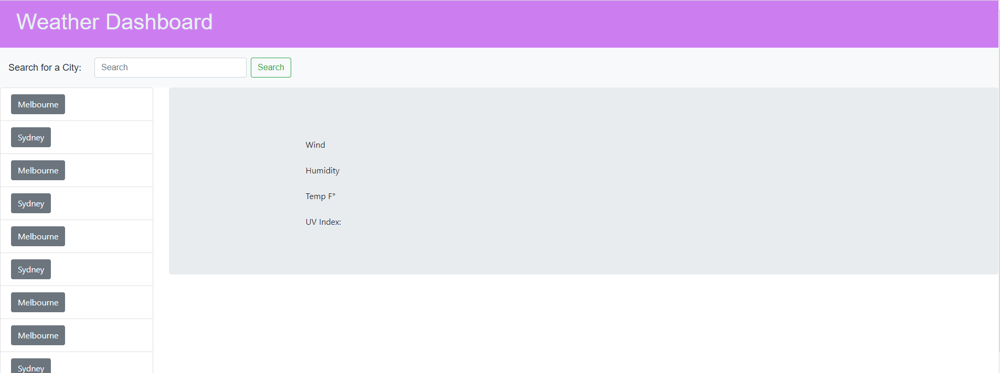

# Weather_Dashboard.io

This Weather Dashboard is designed to inform users of the forecast of any city searched using the API of openweather.org. It also obtains data for a 5 day forecast of that city including UV, humidity and temperature. 

Link to Repository: https://github.com/deezyxp/Weather_Dashboard.io

Link to Website: https://deezyxp.github.io/Weather_Dashboard.io/

